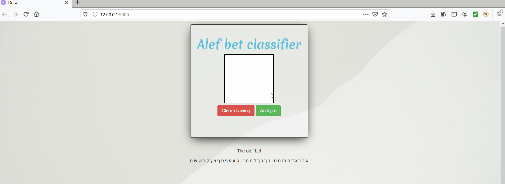

# Hebrew letters Classifier
This project is a web application that lets the user draw a Hebrew letter and classifies it using deep learning.

## Demo

## Technologies used
* Flask (Python for the web)
* fastai (Deep learning library on top of PyTorch)
* Javascript
* HTML
* CSS
* Bootstrap
* (Kaggle) Jupyter notebook 
* conda